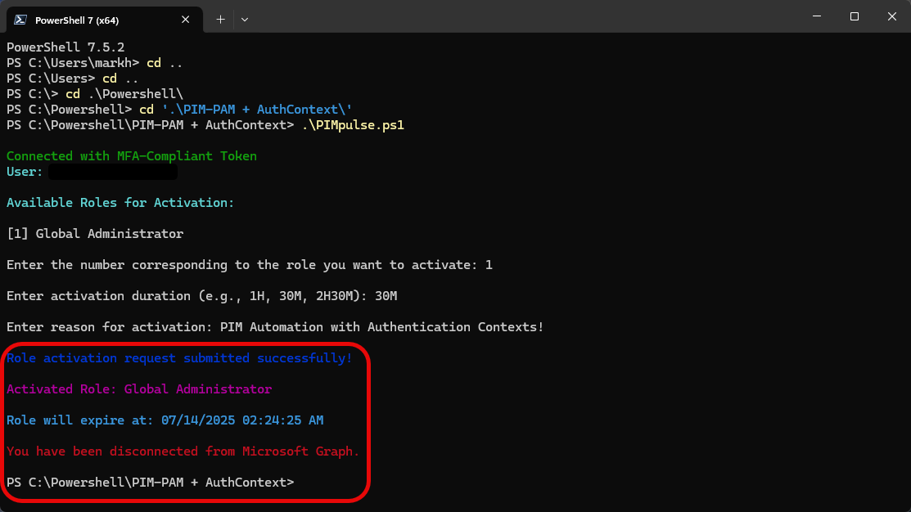

# PIM-Global

Multi-tenant Microsoft Graph PIM Activator with MFA Enforcement

🛡️ **Multi-Tenant Microsoft Graph PIM Activator**
Securely elevate eligible Azure AD roles using Microsoft Graph and MFA-enforced authentication.

---

## 🔧 What It Does

This PowerShell-based tool allows users to:

* Authenticate interactively using **MFA-compliant ACRS tokens**
* Connect securely to **Microsoft Graph**
* View eligible **Azure AD PIM roles**
* Submit a **justified, time-limited activation request**

Supports **cross-tenant** usage with a published **App Registration**.

---

## 🚀 How to Use

### 1. ✅ \[Admin] Grant Consent for Your Tenant

Run this link in a browser (once per tenant):

```
https://login.microsoftonline.com/common/adminconsent?client_id=bf34fc64-bbbc-45cb-9124-471341025093
```

This will:

* Register the PIM-Global app in your tenant
* Grant Graph permissions: `User.Read`, `RoleManagement.Read.Directory`, `RoleManagement.ReadWrite.Directory`

---

### 2. 🧑‍💻 \[User] Run the Script

**Option A** — Run once via GitHub:

📅 Copy & paste this into PowerShell:

```powershell
iex "& { $(irm https://raw.githubusercontent.com/markorr321/PIM-Global/main/PIM-Global.ps1) }"
```

**Option B** — Clone the repo and run:

```powershell
git clone https://github.com/markorr321/PIM-Global.git
cd PIM-Global
.\PIM-Global.ps1
```

---

## ✅ Requirements

* PowerShell 7+
* Graph modules auto-installed:

  * `Microsoft.Graph`
  * `MSAL.PS`
* User must be **eligible** for at least one PIM role

---

## 🧠 Example

### 🟢 Run the Script


### 👤 Select Your Account


### 🔑 Passkey Interaction


### 📷 Scan QR Code


### ✅ MFA Confirmation


### 🎭 Role Retrieval


### 🧾 Selecting Your Role


### ⏳ Role Duration


### 📝 Enter Reason for Activation


### 🟖️ Role Activation Complete



---

## 🔐 Security

This tool uses:

* MSAL interactive login with ACRS enforcement (`acrs=c1`)
* No passwords or secrets stored
* Consent must be granted by a tenant admin

---

## 📜 License

[MIT License](LICENSE)

---

✉️ Questions?

Open an issue or contact **[morr@orr365.tech](mailto:morr@orr365.tech)**
or DM me on Twitter: [@MarkHunterOrr](https://twitter.com/MarkHunterOrr)
